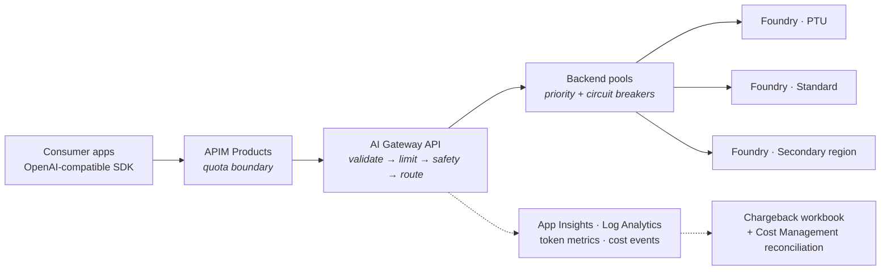

# Azure AI Gateway & Cost Attribution for Microsoft Foundry

Production-grade **Terraform** for the two things enterprise AI platforms need together:

1. **Azure API Management as a centralised AI Gateway** — one governed entry point for every Microsoft Foundry (Azure OpenAI) model deployment, with backend pools, circuit breakers, Entra ID authentication, and token governance.
2. **Per-application cost attribution and chargeback** — defensible answers to *"what did each team spend on AI last month?"*, reconciled against Azure Cost Management.

The second builds on the first and is enabled by a single flag, so you can adopt the gateway now and turn on chargeback when finance asks.

[](https://github.com/zuman88/foundry-ai-gateway-accelerator/actions/workflows/ci.yml)
[](LICENSE)
[](https://developer.hashicorp.com/terraform)

---

## What you get

Two layered scopes in one repository. The second is a strict superset of the first, enabled by one flag.

### Layer 1 — AI Gateway

A single, governed entry point for every Foundry model in your organization.

- **Logical model aliases** — clients call `gpt-chat`, never `gpt-4o-eastus-prod-v3`. Upgrade models without touching client code.
- **Native resiliency** — APIM **backend pools** with priority groups, weighted distribution, and per-backend **circuit breakers** that honour `Retry-After`. PTU capacity first, automatic spill to pay-as-you-go, automatic cross-region failover.
- **Keyless** — APIM's managed identity authenticates to Foundry via RBAC. Foundry accounts run with `local_auth_enabled = false`, so key access is impossible.
- **Token governance** — per-product rate limits *and* period quotas (`llm-token-limit`), keyed per consuming application.
- **Content safety** — `llm-content-safety` with Prompt Shield on chat and responses operations, tunable per harm category.
- **Semantic caching** — optional, off by default, with cache hits correctly reported as savings.
- **Observability** — Application Insights, Log Analytics, and per-request Azure Monitor token metrics emitted by the gateway policy.

### Layer 2 — Cost attribution

Answer "what did each application spend on AI last month?" — defensibly.

- Per-request token accounting across **input, cached input, cache write, output, and reasoning** token classes.
- Cost rates generated from the **Azure Retail Prices API**, expressed per 1 000 000 tokens, versioned with `effectiveDate`.
- **Ratio allocation against Azure Cost Management** — gateway telemetry decides *who*, Azure decides *how much*. Immune to EA discounts, reservations, and PTU amortization.
- A chargeback workbook, per-product budgets, and alerts for **unpriced models**, untiered long-context requests, unmeasured usage, product overspend, and telemetry gaps — the conditions that silently corrupt a chargeback number.

---

## Architecture at a glance



Full detail, including request lifecycle, failover semantics, and the cost model: **[`docs/architecture.md`](docs/architecture.md)**.

---

## Quickstart

### Prerequisites

| Tool | Version |
| --- | --- |
| Terraform | >= 1.9 |
| Azure CLI | >= 2.60 |
| Azure subscription | Contributor + User Access Administrator on the target resource group |

You also need quota for the Foundry model deployments you intend to create.

### Deploy

```bash
git clone https://github.com/zuman88/foundry-ai-gateway-accelerator.git
cd foundry-ai-gateway-accelerator/examples/01-quickstart

az login
az account set --subscription "<your-subscription-id>"

cp terraform.tfvars.example terraform.tfvars   # edit publisher_email at minimum

terraform init
terraform apply
```

APIM provisioning takes roughly 15–45 minutes on first create, depending on tier.

### Verify

```bash
export AI_GATEWAY_ENDPOINT=$(terraform output -raw openai_base_url)
export AI_GATEWAY_KEY=$(terraform output -raw demo_subscription_key)

python ../../scripts/smoke_test.py
```

`smoke_test.py` exercises chat completions, embeddings, streaming, token-limit headers, alias routing, and failover behaviour, then prints a pass/fail table.

Or just point any OpenAI SDK at it:

```python
from openai import OpenAI

client = OpenAI(
    base_url="https://<your-apim>.azure-api.net/openai/v1",
    api_key="<apim-subscription-key>",
)

resp = client.chat.completions.create(
    model="gpt-chat",                      # logical alias, not a deployment name
    messages=[{"role": "user", "content": "Hello"}],
)
print(resp.choices[0].message.content)
```

### Turn on cost attribution

```hcl
enable_cost_attribution = true
```

Then `terraform apply`. See [`examples/03-cost-attribution`](examples/03-cost-attribution) for the full configuration, and [`docs/cost-attribution.md`](docs/cost-attribution.md) for the model.

---

## Repository layout

```
.
├── docs/                      Architecture, cost model, policy walkthrough, ADRs
├── modules/
│   ├── ai-gateway/            APIM API, products, backends, pools, policies
│   ├── foundry-models/        Foundry accounts, model deployments, RBAC
│   ├── observability/         Log Analytics workspace and Application Insights
│   ├── cost-attribution/      Pricing map, chargeback workbook, budgets, reconciliation
│   └── networking/            Optional VNet, subnets, private endpoints, private DNS
├── examples/
│   ├── 01-quickstart/         Single region, public, minimal cost
│   ├── 02-production-private/ Multi-region backends, private endpoints, WAF-ready
│   └── 03-cost-attribution/   Layer 1 + Layer 2 with chargeback enabled
├── tests/                     Unit tests for the pricing meter matcher
└── scripts/                   Pricing map generator, smoke test, policy render check
```

Workbook definitions live with the module that deploys them, in
`modules/cost-attribution/workbooks/`.

---

## Configuration model

Everything meaningful is a variable. The three that shape the deployment most:

```hcl
# Which models exist, and where.
model_deployments = {
  "gpt-4o" = {
    model_name    = "gpt-4o"
    model_version = "2024-11-20"
    sku_name      = "GlobalStandard"
    capacity      = 100
  }
  "text-embedding-3-large" = {
    model_name    = "text-embedding-3-large"
    model_version = "1"
    sku_name      = "Standard"
    capacity      = 50
  }
}

# What clients are allowed to ask for, and how it routes.
model_routes = {
  "gpt-chat" = {
    deployment       = "gpt-4o"
    backend_priority = {
      "eastus-ptu" = 1
      "eastus-std" = 2
      "westeurope-std" = 3
    }
  }
}

# Commercial tiers.
products = {
  "ai-standard" = {
    tokens_per_minute  = 60000
    token_quota        = 50000000
    token_quota_period = "Monthly"
  }
  "ai-premium" = {
    tokens_per_minute  = 300000
    token_quota        = 500000000
    token_quota_period = "Monthly"
  }
}
```

Terraform validates at plan time that every alias in `model_routes` resolves to a deployment that exists in every Foundry account in its pool — the **deployment-name parity** requirement that backend pools depend on.

Full variable reference: [`modules/ai-gateway/README.md`](modules/ai-gateway/README.md).

---

## Design decisions worth knowing

| Decision | Rationale | ADR |
| --- | --- | --- |
| Native backend pools instead of a `<retry>` loop over a backend map | Circuit breakers are stateful across requests; a retry loop makes every caller rediscover a dead backend | [0001](docs/decisions/0001-native-backend-pools.md) |
| Managed identity only; `local_auth_enabled = false` | Keys become impossible rather than merely discouraged | [0002](docs/decisions/0002-managed-identity-only.md) |
| `azapi` provider for backend pools and a few preview properties | AzureRM does not expose `type = "Pool"` on `azurerm_api_management_backend` | [0003](docs/decisions/0003-azapi-for-backend-pools.md) |
| Ratio allocation against Cost Management, not raw gateway estimates | Survives contact with a finance team; immune to discounts and reservations | [0004](docs/decisions/0004-ratio-allocation-chargeback.md) |
| App Insights verbosity and sampling pinned for the LLM API | The `trace` policy silently undercounts at default settings — the most common cost-tracking bug | [0005](docs/decisions/0005-telemetry-sink-selection.md) |
| Alias routing with GA primitives rather than the preview unified model API | Preview features do not belong in a reusable production accelerator yet; migration path documented | [0006](docs/decisions/0006-alias-routing-vs-unified-model-api.md) |

---

## Costs

The quickstart example is deliberately cheap. Approximate monthly cost of the *platform* (excluding model inference):

| Component | Quickstart | Production profile |
| --- | --- | --- |
| APIM Standard v2 | ~$150 | ~$150–700 (scale units) |
| Log Analytics + App Insights | ~$5–30 | volume-dependent |
| Content Safety | disabled | ~$1 per 1 000 transactions |
| Managed Redis (semantic cache) | disabled | from ~$40 |
| Private endpoints | none | ~$8 each |

Run `terraform plan` with [Infracost](https://www.infracost.io/) against your own subscription for a real figure.

---

## Contributing

Issues and pull requests are welcome. See [CONTRIBUTING.md](CONTRIBUTING.md). CI enforces `terraform fmt`, `terraform validate` across every module and example, `tflint`, `checkov`, the Python test suite, and `scripts/check_policies.ps1`.

That last one matters more than it sounds: `templatefile()` is evaluated at plan time, so `terraform validate` never renders the policy templates and cannot see malformed XML inside them. If you edit a `.tftpl`, run `check_policies.ps1` — it is the only check that would catch the error before an apply against live APIM.

## Security

Please report vulnerabilities as described in [SECURITY.md](SECURITY.md). Do not open a public issue for security problems.

## Author

Built and maintained by **Muazu Isah**, Cloud Solution Architect at Microsoft — [@zuman88](https://github.com/zuman88).

This grew out of repeated customer engagements where the same problems kept surfacing: a model name hard-coded into forty services, no way to answer which team spent what, and a gateway that worked until the day one region throttled. The patterns here are the ones that held up in production, written down so the next engagement starts further along.

## License

[MIT](LICENSE).

## Disclaimer

**This is a personal project. It is not a Microsoft product, it is not endorsed by or affiliated with Microsoft, and it carries no support commitment from Microsoft or anyone else.** Opinions and design choices here are my own and do not represent the positions, strategies, or opinions of my employer. Use it at your own risk, and review it as you would any third-party code before it touches a production subscription.

Gateway-computed costs are estimates intended for showback and anomaly detection. **Azure Cost Management is the authoritative source for billing.** Read [`docs/architecture.md` §10](docs/architecture.md#10-limits-and-honest-caveats) before production use — it is an honest list of what this does not do.

## Trademarks

Microsoft, Azure, Microsoft Foundry, and Azure OpenAI Service are trademarks of the Microsoft group of companies. This project uses those names only to describe the Azure services it configures. It is an independent work and implies no sponsorship or endorsement. Third-party trademarks are the property of their respective owners.
