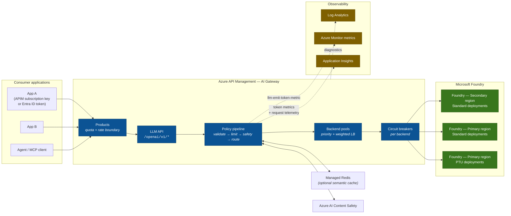
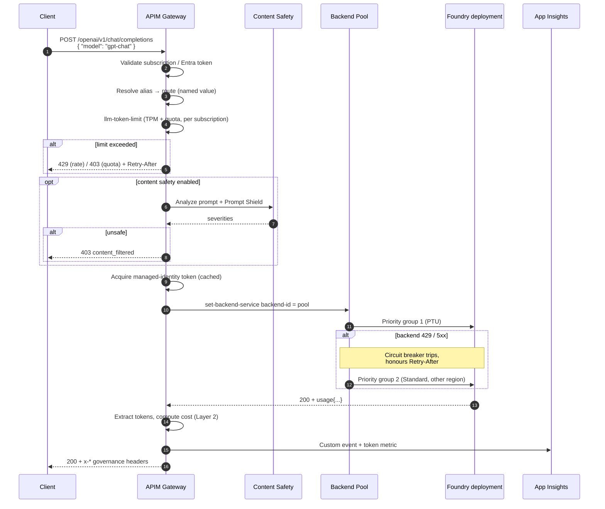
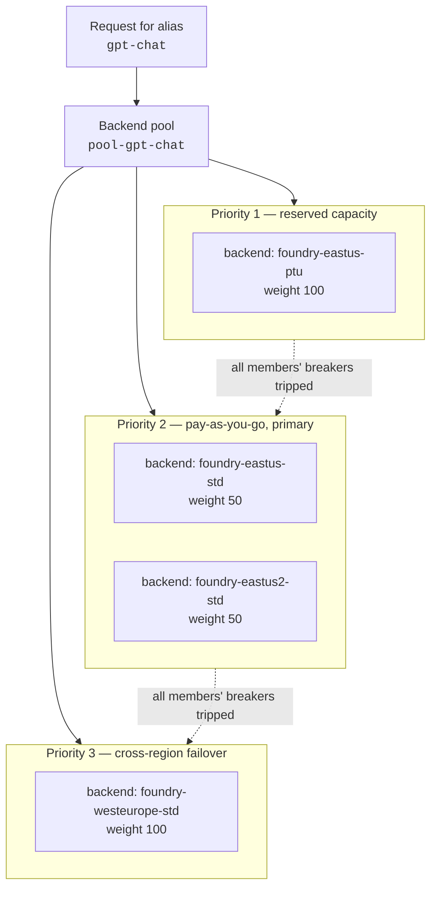
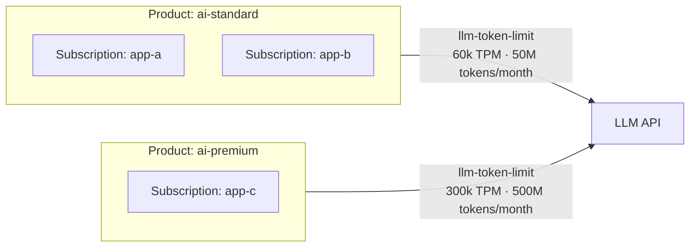
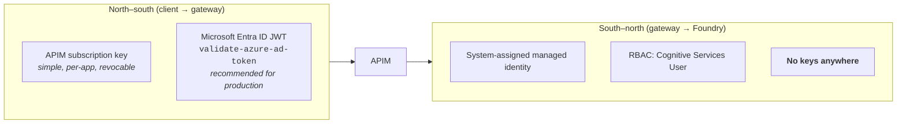
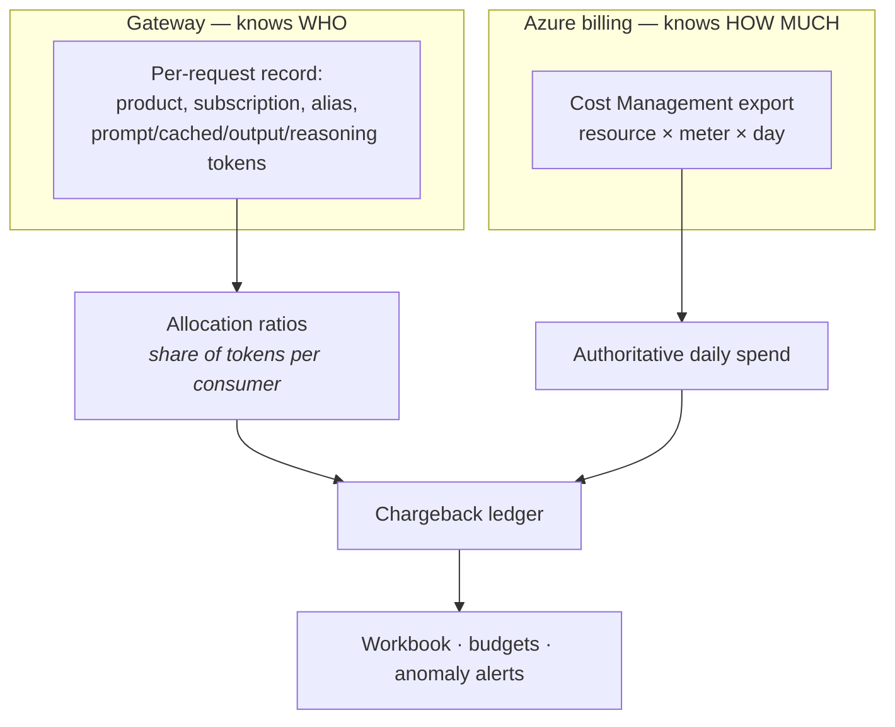
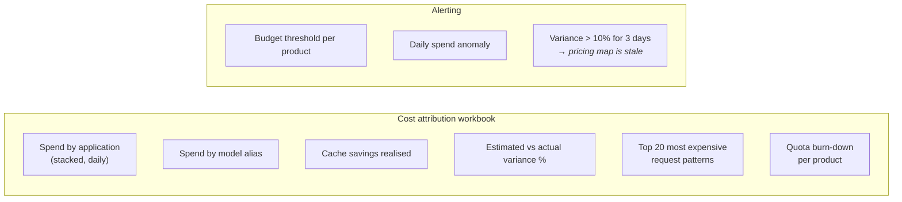
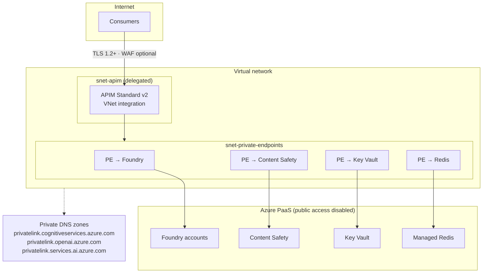
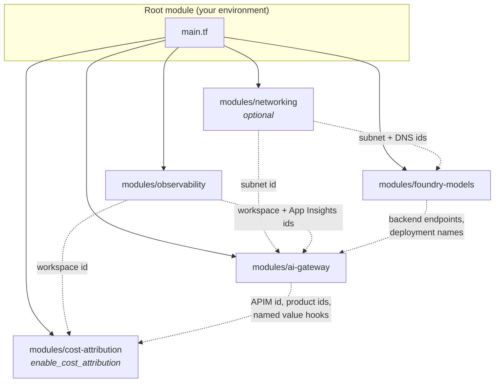
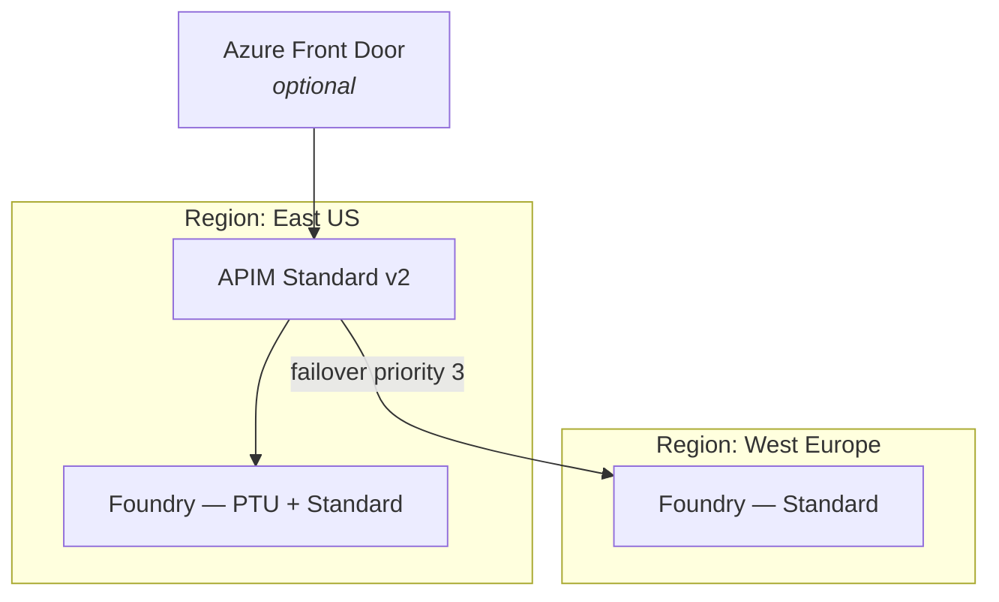

# Architecture — Foundry AI Gateway Accelerator

> **Audience:** solution architects and platform engineers standing up a centralized, governed entry point for Microsoft Foundry model deployments using Azure API Management (APIM).

This document describes two deployable scopes that are deliberately layered:

| Scope | Name | What it delivers |
| --- | --- | --- |
| **Layer 1** | **AI Gateway** | A production-grade, centralized APIM entry point in front of Foundry model deployments: identity, routing, resiliency, throttling, safety, observability. |
| **Layer 2** | **Cost Attribution** | Per-consumer token and cost accounting on top of Layer 1, plus reconciliation against authoritative Azure billing. |

Layer 2 is a strict superset of Layer 1. It is enabled with a single feature flag (`enable_cost_attribution = true`) and adds no new request-path dependencies that can fail the gateway.

---

## 1. Problem statement

Organizations adopting Foundry models hit the same five problems as they move from pilot to production:

1. **Sprawl.** Every team provisions its own Foundry resource and keys. There is no inventory, no common policy, and no way to rotate credentials.
2. **Quota contention.** One noisy application consumes the tokens-per-minute (TPM) quota of a shared deployment and starves everyone else.
3. **Fragility.** A single regional deployment returns `429` with a long `Retry-After`, and every downstream app fails.
4. **Opacity.** Azure bills at the level of the Foundry *resource*. Finance cannot answer "what did the claims-triage app cost us last month?"
5. **Ungoverned content.** Prompts and completions are not moderated, logged, or auditable.

A centralized AI gateway solves all five, provided it is built on native platform capability rather than bespoke policy code.

---

## 2. Design principles

These principles drove every decision in this accelerator, and each one is traceable to an ADR in [`docs/decisions/`](decisions/).

| # | Principle | Consequence |
| --- | --- | --- |
| P1 | **Prefer native platform features over policy code.** | Backend pools and circuit breakers replace hand-written retry loops. Less policy, fewer bugs, better behaviour under load. |
| P2 | **Keyless by default.** | APIM authenticates to Foundry with a managed identity and `Cognitive Services User` RBAC. No keys in Key Vault, no rotation burden. |
| P3 | **The gateway must never be the reason a request fails.** | Cost accounting, content safety, and telemetry are configured so a failure in an optional component degrades gracefully rather than returning `5xx`. |
| P4 | **Estimated cost is a *management* signal, not an invoice.** | Gateway-computed cost drives showback, alerts, and anomaly detection. Azure Cost Management remains authoritative, and we ship a reconciliation loop. |
| P5 | **Client contract stability.** | Consumers call an OpenAI-compatible endpoint with a logical model alias. Backend deployment names, regions, and SKUs change without client code changes. |
| P6 | **Everything is Terraform, everything is a variable.** | No portal clicks in the golden path. Reusable by any organization, not just Microsoft. |

---

## 3. Layer 1 — AI Gateway

### 3.1 Logical architecture



### 3.2 Request lifecycle



### 3.3 Component decisions

#### Routing: logical aliases, not deployment names

Clients send a **logical alias** (`gpt-chat`, `gpt-reasoning`, `text-embedding`) in the `model` field. The gateway maps that alias to a route definition held in an APIM named value:

```jsonc
{
  "gpt-chat": {
    "pool":       "pool-gpt-chat",       // APIM backend pool
    "deployment": "gpt-4o",              // physical deployment name (parity across regions)
    "apiFormat":  "openai",              // openai | foundry-models
    "apiVersion": "v1"
  }
}
```

This gives you model upgrades, A/B tests, and region migrations with **zero client changes** (principle P5).

> **Deployment-name parity is a hard requirement.** Every Foundry account that participates in a pool must expose the *same* deployment name for a given alias. The `foundry-models` module enforces this by deploying an identical deployment set to every account by default. Without parity, a single pool cannot serve a single alias, and you are forced back into per-request backend selection logic.

#### Resiliency: native pools + circuit breakers

This is the single largest improvement over a hand-rolled gateway.



Key platform behaviours the accelerator relies on:

- Load balancing options are **round-robin**, **weighted**, and **priority-based**, with optional session awareness. A pool holds up to **30 backends**.
- Lower-priority groups are used **only when every backend in all higher-priority groups has a tripped circuit breaker**. This is precisely the semantics you want for "PTU first, spill to PAYG."
- A circuit breaker rule can **accept the `Retry-After` header** as its trip duration. This matters enormously for Foundry: a throttled deployment can return `Retry-After` measured in hours, and honouring it prevents the gateway from hammering a dead backend.
- **Only one circuit breaker rule per backend is currently supported**, so the accelerator encodes both `429` and `5xx` into a single rule via a status-code range plus `acceptRetryAfter`.

**Why not the retry-with-index pattern?** A `<retry>` loop that walks an ordered backend list works, but it is stateless per request: every single request re-discovers that a backend is dead, paying full latency and consuming backend capacity each time. A circuit breaker is *stateful across requests* — once tripped, traffic bypasses the failed backend entirely. Pools also give you weighting and blue/green shifting for free.

#### Throttling: product-scope token governance

Rate limiting belongs at the **product** scope, not the API scope, because the product is the commercial and governance boundary:



`llm-token-limit` enforces a **rate** (`tokens-per-minute` → `429`) and/or a **quota** (`token-quota` over `token-quota-period` of Hourly…Yearly → `403`), keyed on any expression. The accelerator keys on `context.Subscription.Id` so each consuming application gets its own counter within its product's allowance.

Important operational notes baked into the module and its docs:

- Counters are **per gateway unit and per region**; they are not aggregated across a multi-region deployment. Size limits accordingly.
- The **v2 tiers use a token-bucket algorithm** while classic tiers use a sliding window. If you configure the same `counter-key` at multiple scopes in v2, the `tokens-per-minute` values must match or behaviour is undefined. The module therefore emits the limit at exactly one scope per counter key.
- With `estimate-prompt-tokens="true"` the gateway rejects oversized prompts before they reach Foundry, saving backend quota at a small latency cost. For **streaming** responses prompt *and* completion tokens are always estimated.

#### Identity and access



Caller authentication is selected with the `caller_authentication` variable, which has three modes:

| Mode | Credentials | Attribution key | Product-scope policy |
|---|---|---|---|
| `subscription_key` (default) | `api-key` header | Subscription id | Runs |
| `both` (**recommended for production**) | `api-key` **and** Entra bearer token | Entra claim (`appid`, falling back to `azp`/`oid`/`sub`) | Runs |
| `entra_id` | Entra bearer token only | Entra claim | **Does not run** |

`both` is recommended because it is the only mode that strengthens attribution without giving anything up. The subscription key is what lets APIM resolve the product, and the product is what carries per-tier token limits and `allowed_models` entitlement; the Entra token is what the cost ledger attributes spend to. A subscription key is a bearer secret that can be copied into a second service without trace, at which point the chargeback report is wrong and nothing says so — an Entra token is bound to an app registration or managed identity and expires on its own.

`entra_id` removes the subscription entirely, which is cleanest from a secret-management point of view but costs a governance tier: APIM does not execute product-scope policy for a request it cannot associate with a product. The module requires `caller_authentication.tokens_per_minute` in that mode and applies it as a single gateway-wide limit, and **fails the plan** if any product declares controls that would be silently ignored.

In the Entra modes at least one of `audiences` or `client_application_ids` must be set; the module refuses a configuration with neither, because validating only the tenant accepts any token that tenant ever issued — including one minted for a different API. See [ADR-0007](decisions/0007-entra-id-caller-authentication.md) for the full reasoning, including why rate limiting stays keyed on the subscription while attribution moves to the token.

Foundry accounts are configured with `local_auth_enabled = false` by default, so key-based access is **impossible**, not merely discouraged.

#### Content safety

`llm-content-safety` is applied in the **inbound** section for chat and responses operations, with Prompt Shield enabled and all four harm categories thresholded. It is deliberately **not** applied to embeddings operations, where it adds latency and cost for no benefit.

The module exposes thresholds per category so customers can tune to their risk appetite, and supports blocklists.

#### Semantic caching (optional, off by default)

`llm-semantic-cache-lookup` / `llm-semantic-cache-store` require an external RediSearch-compatible cache (Azure Managed Redis). The accelerator ships the wiring behind `enable_semantic_cache` but defaults it **off**, because the cache costs real money and only pays for itself under high prompt-similarity workloads.

When enabled, cache hits are explicitly marked in telemetry (`cacheHit=true`, `estimatedCostUSD=0`) so that they show up as *savings* rather than silently distorting cost attribution.

---

## 4. Layer 2 — Cost attribution

### 4.1 The core insight

Azure bills Foundry at the granularity of **resource × meter × region**. Your internal chargeback question is at the granularity of **application × model × time**. Nothing in the Azure billing pipeline knows about your applications. The gateway is the only place where both facts are simultaneously true, so the gateway must be the point of record for *allocation* — while Azure remains the point of record for *amount*.



This "**ratio allocation**" model is materially more defensible than publishing gateway-estimated dollars as if they were the invoice. Gateway estimates drift from the invoice for entirely legitimate reasons: negotiated discounts, reservations, PTU amortization, commitment tiers, and mid-month price changes. Ratio allocation is immune to all of them — if your gateway says App A consumed 30% of `gpt-4o` input tokens, App A is charged 30% of the actual `gpt-4o` input meter, whatever that turned out to be.

The accelerator publishes **both** numbers and the variance between them. A persistent variance is a signal that your pricing map is stale.

### 4.2 Telemetry sinks, and an honest warning

| Sink | Cardinality | Latency | Fidelity | Used for |
| --- | --- | --- | --- | --- |
| `llm-emit-token-metric` → Azure Monitor custom metrics | **Low** (≤5 dimensions, ≤100 values each, ≤1 000 time series per namespace) | Near-real-time | Aggregated | Dashboards, alerts, autoscale signals |
| App Insights custom telemetry via `trace` | **High** (per request) | Seconds | Per-request detail | Chargeback ledger, forensics |
| Event Hub via `log-to-eventhub` | **High** | Seconds | Per-request, no sampling | Audit-grade retention (optional) |

> ### ⚠️ Read this before you rely on `trace` for billing
>
> The `<trace>` policy only emits to Application Insights when the API's diagnostic **verbosity is set to `verbose`**, and its output is subject to the logger's **sampling percentage**. A default APIM deployment samples telemetry, which means a naive `trace`-based cost tracker **silently undercounts**.
>
> This accelerator therefore:
> - sets the APIM Application Insights logger `sampling_percentage = 100` for the LLM API,
> - sets diagnostic `verbosity = "verbose"` on the LLM API specifically (not globally, to control cost),
> - emits a **monotonic request counter** alongside cost so you can detect gaps by comparing the App Insights record count against the APIM `Requests` platform metric, and
> - ships an optional Event Hub path (`enable_eventhub_audit`) for customers who need audit-grade, unsampled records.
>
> If your prior gateway used `trace` at default verbosity, its cost numbers were probably low. This is the most important correctness fix in the accelerator.

Because metrics are low-cardinality, the accelerator puts **only** stable, bounded dimensions on `llm-emit-token-metric` — Product ID, model alias, and backend — and never subscription ID, which is unbounded and would blow the 100-unique-value limit and silently discard data.

### 4.3 Cost model

Rates are expressed **per 1 000 000 tokens**, matching how Azure publishes them, and include the distinct token classes that modern models bill separately:

```jsonc
{
  "gpt-chat": {
    "currency": "USD",
    "unit": 1000000,
    "input": 2.50,          // uncached prompt tokens
    "cachedInput": 0.25,    // prompt tokens served from the model's prompt cache
    "cacheWrite": 3.125,    // tokens written to cache (models that bill this)
    "output": 10.00,        // completion tokens, INCLUDING reasoning tokens
    "effectiveDate": "2026-01-01",
    "meterName": "gpt-4o Inp glbl Tokens"   // for reconciliation join
  }
}
```

The cost expression is:

```
cost = (promptTokens − cachedTokens − cacheWriteTokens) / unit × input
     + cachedTokens                                      / unit × cachedInput
     + cacheWriteTokens                                  / unit × cacheWrite
     + completionTokens                                  / unit × output
```

Three correctness rules encoded in the policy and enforced by unit tests:

1. **Reasoning tokens are already inside `completion_tokens`.** They are reported separately in `completion_tokens_details.reasoning_tokens` for visibility and must **not** be added again. Double-counting reasoning tokens is a common and expensive bug.
2. **Cached tokens are a subset of `prompt_tokens`,** reported in `prompt_tokens_details.cached_tokens`. Non-cached prompt tokens are the *difference*, floored at zero.
3. **Store unrounded cost; round only for presentation.** Rounding to six decimals per request and then summing millions of requests accumulates material error. The policy emits full precision and the workbook formats it.

The Responses API reports the same data under different names (`input_tokens`, `output_tokens`, `input_tokens_details`, `output_tokens_details`), so extraction is written to accept both shapes.

### 4.4 Keeping the pricing map honest

`scripts/generate_pricing_map.py` queries the **Azure Retail Prices API** (`https://prices.azure.com/api/retail/prices`) and renders a pricing map, so the rates in your gateway are derived from a Microsoft-published source rather than hand-typed from a blog post. A scheduled GitHub Actions workflow re-runs it and opens a pull request when rates move.

Retail prices are list prices. If the customer has an Enterprise Agreement or MCA discount, the reconciliation loop in §4.1 corrects for it automatically, and `scripts/reconcile_costs.py` reports the effective discount it observed.

#### Context-length pricing

Not every model has one flat rate. Azure prices some by **input length**: GPT-5.5 doubles its input rate and raises output by half above **272,000 prompt tokens**, and the whole request reprices — it is not marginal. A flat-rate entry under-reports such a request by roughly half, and produces a number that looks entirely plausible while doing so.

A `pricing_map` entry may therefore carry an optional `contextTiers` array, and the gateway selects the applicable card from the request's prompt token count before pricing it:

```json
"gpt-5-5": {
  "unit": 1000000,
  "input": 5.0, "cachedInput": 0.5, "output": 30.0,
  "contextTiers": [
    { "name": "long", "minPromptTokens": 272001,
      "input": 10.0, "cachedInput": 1.0, "output": 45.0 }
  ]
}
```

The threshold is measured on **total** prompt tokens, cached ones included — caching changes what a token costs, not whether the model had to carry it. The generator emits these tiers automatically for models it knows the threshold for, and refuses to guess one it does not: the Retail Prices API publishes the long-context rates but never the boundary.

Configuring a tier is optional, because a workload that never approaches the threshold is correctly priced by a flat rate. The gap is made observable instead of mandatory — the ledger records which tier priced each request as `contextTier`, and the `untiered_long_context` alert fires when long prompts are being costed at the base rate. See [ADR-0008](decisions/0008-context-length-pricing-tiers.md).

### 4.5 What the customer actually sees



---

## 5. Network and security posture



The production profile (`examples/02-production-private`) applies:

- APIM **outbound VNet integration** so all backend traffic traverses private endpoints.
- `public_network_access_enabled = false` on every Foundry account, Content Safety, Key Vault and Redis.
- All three Foundry private DNS zones linked — Foundry resources answer on `cognitiveservices`, `openai`, **and** `services.ai` hostnames, and missing any one of them produces intermittent, hard-to-diagnose failures.
- Managed identity everywhere, `local_auth_enabled = false`.
- Diagnostic settings to Log Analytics on every resource.
- Optional Azure Front Door / Application Gateway WAF in front of the gateway for public-facing workloads.

---

## 6. What this improves over a hand-rolled gateway

This accelerator is a deliberate rewrite of an earlier working implementation. The table below is the migration rationale.

| Area | Typical hand-rolled approach | This accelerator | Why it matters |
| --- | --- | --- | --- |
| **Failover** | `<retry>` loop over a JSON backend map with an index variable | Native **backend pools** with priority groups, weights, and per-backend **circuit breakers** honouring `Retry-After` | Stateful across requests; a dead backend is bypassed instead of being retried by every caller. Removes ~60 lines of policy. |
| **Routing** | Parse body, look up backend in named-value JSON, `set-backend-service` per attempt | Alias → pool lookup, single `set-backend-service` | Far less policy expression code in the hot path; no per-attempt JSON parsing. |
| **Cost telemetry** | `<trace>` at default verbosity | `trace` with **verbosity pinned to verbose and sampling pinned to 100%**, plus `llm-emit-token-metric`, plus optional Event Hub | Fixes silent undercounting — the highest-impact correctness bug. |
| **Chargeback basis** | Publish gateway-estimated dollars | Publish estimate **and** ratio-allocated actuals from Cost Management, plus variance | Defensible in front of a finance team; immune to discounts and reservations. |
| **Pricing rates** | Hand-maintained map, per 1 000 tokens | Generated from the **Retail Prices API**, per 1 000 000 tokens, with `effectiveDate` and `meterName` | Rates stop drifting; reconciliation can join on meter. |
| **Token classes** | prompt / cached / completion | Adds **cacheWrite**; documents that reasoning tokens are already inside completion | Prevents double-counting and under-counting on newer models. |
| **Rounding** | `Math.Round(..., 6)` before storage | Full precision stored, rounded at presentation | Removes accumulated rounding error at scale. |
| **Throttling** | Single hardcoded TPM at API scope | Per-product **rate + quota** (`token-quota` / `token-quota-period`) at product scope | Real commercial tiering; monthly budgets enforceable in the gateway. |
| **Metric cardinality** | n/a | Bounded dimensions only, documented limits | Avoids silently discarded metrics once >100 unique dimension values appear. |
| **Auth to backend** | `authentication-managed-identity` + header manipulation | Same, but Foundry `local_auth_enabled = false` | Keys become impossible, not just unused. |
| **Delivery** | Portal-configured, manually exported XML | Terraform modules, examples, unit tests, CI | Reusable across engagements; reviewable; diffable. |

---

## 7. Module composition



Each module is independently usable. `modules/ai-gateway` can be pointed at pre-existing Foundry accounts, which is the common case in a brownfield engagement.

---

## 8. Deployment topologies

### 8.1 Single region, quickstart

Fastest path to a working demo. APIM Standard v2, one Foundry account, public networking, no content safety, no cache.

### 8.2 Multi-region, production



Standard v2 is single-region for the gateway itself; multi-region **gateway** presence requires Premium. Multi-region **backend** failover works on any tier via pools, which is what most engagements actually need. The `apim_sku_name` variable makes the upgrade a one-line change.

### 8.3 Data-zone and sovereignty

Where data residency is a constraint, deploy one gateway per data zone and use `DataZoneStandard` deployment SKUs, keeping pools scoped within the zone. The `foundry-models` module exposes `deployment_sku_name` per deployment for exactly this.

---

## 9. Operational model

| Concern | Mechanism |
| --- | --- |
| Onboarding a new consumer | Add an entry to `var.products` / `var.subscriptions`; Terraform issues keys and quota. |
| Adding a model | Add a deployment to `var.model_deployments` and a route to `var.model_routes`. Parity is validated at plan time. |
| Retiring a model | Point the alias at a new deployment. Clients are unaffected. |
| Regional outage | Circuit breakers trip automatically; traffic moves to the next priority group. Alert fires on breaker trips. |
| Quota exhaustion | `403` with `Retry-After`; burn-down visible in the workbook before it happens. |
| Price change | Scheduled workflow opens a PR against the pricing map; variance alert catches anything missed. |
| Policy change | Edit XML under `modules/ai-gateway/policies/`, run `terraform plan`, review the diff. |

---

## 10. Limits and honest caveats

- **Token counters are per-gateway-unit and per-region.** They are not globally aggregated. With multiple scale units, effective limits are higher than the configured number. Size with that in mind, and treat `llm-token-limit` as protection against runaway consumption rather than a precise billing meter.
- **Streaming responses estimate tokens.** For exact accounting on streamed calls, clients must send `stream_options: { "include_usage": true }`. The accelerator's policy adds this automatically when absent, and flags records where estimation was used.
- **A pool holds at most 30 backends**, and **one circuit breaker rule per backend**.
- **The unified model API** (a native APIM feature that fronts multiple providers with automatic format translation) is **in preview** at time of writing. The accelerator implements alias routing with GA primitives instead, and documents the migration path in [ADR-0006](decisions/0006-alias-routing-vs-unified-model-api.md).
- **Backend pools and managed-identity backend credentials are not fully exposed by the AzureRM Terraform provider.** The accelerator uses the `azapi` provider for those specific resources. See [ADR-0003](decisions/0003-azapi-for-backend-pools.md).
- **Gateway cost is an estimate.** See §4.1. Do not put it on an invoice without reconciliation.

---

## 11. Where to go next

- [`docs/cost-attribution.md`](cost-attribution.md) — the chargeback model in depth, KQL queries, reconciliation procedure.
- [`docs/policies.md`](policies.md) — annotated walkthrough of every policy fragment.
- [`docs/operations.md`](operations.md) — day-2 runbook.
- [`docs/decisions/`](decisions/) — architecture decision records.
