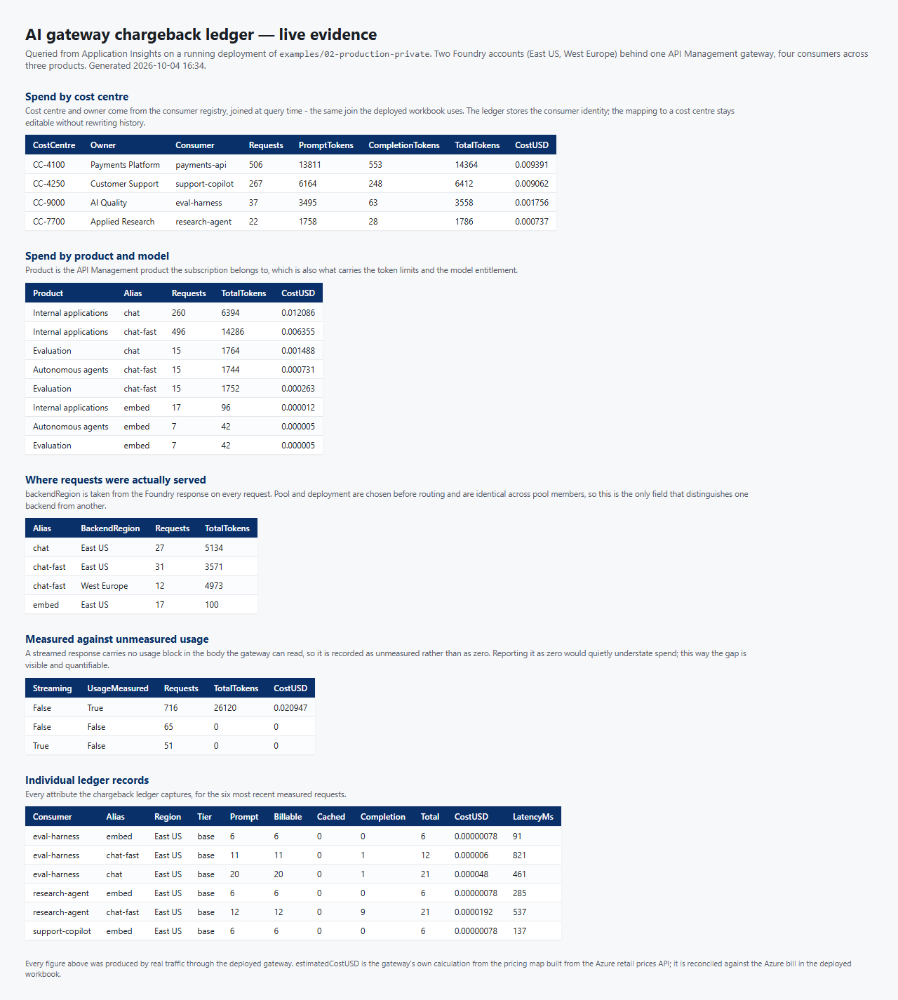

# Validation

Everything in this document was produced by deploying the examples to a real Azure subscription and
driving real traffic through them. No figure here is estimated, and nothing was asserted that was not
measured.

It is written up for one reason: an accelerator that has only ever been linted is a plausible-looking
guess. Of the defects listed below, **none** could be caught by `terraform validate`, `terraform fmt`,
`tflint`, `checkov`, or the repository's own policy renderer. Every one of them needed an apply
against a live subscription, and several needed live traffic on top of that.

| | |
|---|---|
| Subscription | Visual Studio Enterprise subscription, single tenant |
| Regions | East US (primary), West Europe (secondary) |
| Gateway | API Management, VNet-injected, External |
| Models | `gpt-4.1` and `gpt-4.1-mini` @ `2025-04-14`, `text-embedding-3-large` @ `1` |
| Examples | `01-quickstart`, `02-production-private` |

---

## 1. What was tested

| Area | How | Result |
|---|---|---|
| Quickstart deploys and works | `terraform apply`, then `scripts/smoke_test.py` | 10 / 10 checks pass |
| Production example deploys and works | `terraform apply`, then `scripts/smoke_test.py` | 10 / 10 checks pass |
| Weighted load balancing | 200 requests at `chat-fast`, pool weighted 70 / 30 | 69.8 % / 30.2 % |
| Priority failover | 70 requests at `chat`, pool priority 1 / 2 | primary-only until it throttled, then spill |
| Streaming | `scripts/smoke_test.py`, plus a direct comparison against Foundry | 50 chunks over 0.23 s |
| Chargeback ledger | 79 requests across 4 consumers and 3 products | every attribute populated |
| Content safety | prompts from 5 k to 16 k characters | limit found and handled |
| Pricing map | `scripts/generate_pricing_map.py` | live Azure retail prices API |

---

## 2. Load balancing

### How the backend is identified

A load-balanced pool cannot be verified without knowing which member served each request, and at the
start of this exercise nothing exposed that. `x-ai-deployment` and `x-ai-pool` are both resolved
*before* routing, so every member of a pool reports identical values, and the gateway deliberately
deletes Foundry's own `x-ms-region` header to avoid leaking backend detail.

The gateway now promotes that region to `x-ai-region` on the response and `backendRegion` in the
ledger. A region name is not a hostname or a resource name, so nothing sensitive is disclosed, and
load balancing becomes verifiable by the caller rather than a matter of trust.

### Weighted pool — 70 / 30

`chat-fast` is configured across both regions with weights 70 and 30 at equal priority.

```
python scripts/loadbalance_test.py --alias chat-fast --requests 200 --delay 0.25 \
    --expect "East US=70" --expect "West Europe=30"
```

```
  199 succeeded, 1 failed

  REGION                   COUNT     SHARE
  East US                    139     69.8%
  West Europe                 60     30.2%

  East US                expected  70.0%  actual  69.8%  PASS
  West Europe            expected  30.0%  actual  30.2%  PASS
```

An earlier run of the same test reported 53 / 47 and looked like a weighting bug. It was not: that
run produced ten `429`s from the primary, and the circuit breaker correctly diverted traffic to the
secondary. Reading the backend configuration out of Azure confirmed the weights had been 70 and 30
all along. **Under throttling, the observed split is not the configured split, and it should not
be** — that is the breaker working. Raising the deployment capacity removed the throttling and the
configured ratio appeared almost exactly.

### Priority pool — failover

`chat` is configured with the same two regions at priority 1 and 2. A priority pool looks wrong when
it is working, because provoking any failure produces a split, and a bare percentage cannot tell
"failover engaged" apart from "weights are wrong". Ordering can:

```
  60 succeeded, 10 failed

  REGION                   COUNT     SHARE
  East US                     46     76.7%
  West Europe                 14     23.3%

  failover timeline
    first failure at request 33 of 70
    requests to East US before that: 32
    requests elsewhere before that: 0
    requests elsewhere after that:  14
    -> consistent with priority failover: the preferred region took everything
       until it started refusing, and only then did traffic move
```

Not one request reached the secondary region before the primary began refusing work, and every
secondary request came after. That is exactly the contract of a priority pool. `loadbalance_test.py`
now performs this correlation itself, so the conclusion is reproducible rather than hand-checked.

---

## 3. Cost attribution

79 requests were driven through four consumers across three products, mixing short prompts, large
prompts, streaming and embeddings, then read back out of the ledger.



Points worth drawing out:

- **Cost centre is joined at query time**, not stamped on each record. The ledger stores the consumer
  identity; the registry maps it to a cost centre and owner. Re-organising cost centres therefore
  does not require rewriting history.
- **Unmeasured usage is recorded as unmeasured, never as zero.** In the run above, 51 streamed
  requests and 65 failed requests carry no usage, because a streamed response has no usage block the
  gateway can read and a rejected request never reached a model. Reporting those as zero would
  quietly understate spend; reporting them as unmeasured makes the gap visible and quantifiable.
- **`estimatedCostUSD` is the gateway's own calculation**, from a pricing map generated against the
  live Azure retail prices API, and is reconciled against the real bill in the deployed workbook.
  Per-request costs run to eight decimal places — a ten-token embedding costs about `0.00000078` USD,
  which is why the field is formatted at that precision rather than rounded to cents.

---

## 4. Defects found and fixed

Every one of these was found by deploying. They are listed because the failure modes are
instructive, not merely because they were fixed.

### Resource counts gated on unknown values — three modules

`count` and `for_each` were gated on whether another resource's attribute was null, for resources
created in the same apply. Terraform cannot resolve that at plan time:

```
Invalid count argument: the "count" value depends on resource attributes
that cannot be determined until apply.
```

Both examples were unappliable, including the private-endpoint block that is example 02's headline
feature. `terraform validate` does not resolve `count` or `for_each`, so nothing in CI could see it.
Fixed with plan-time-known booleans (`enable_diagnostics`, `enable_private_endpoints`) plus
preconditions that name the offending value at apply time.

### Response body reads disabled streaming

An expression reading `context.Response.Body` makes API Management buffer the entire response before
outbound policy runs — **even when the expression provably never executes**. The read was guarded on
`Content-Type: application/json`, and streamed responses are `text/event-stream`, so it never ran, and
the gateway buffered anyway.

Measured: Foundry streamed 50 chunks over 0.80 s; the gateway released all 50 within **1 ms**. The
fix skips the element entirely for streamed requests rather than guarding inside it, restoring a
0.23 s spread while non-streaming token accounting continues to work.

### Content safety was called without credentials

Every generative request failed with `403 Request failed content safety check`, while embeddings —
which skip content safety — kept working. The gateway therefore looked like it was moderating
correctly rather than like it was broken. Telemetry showed the truth:

```
401 Access denied due to invalid subscription key or wrong API endpoint.
```

`llm-content-safety` forwards the request's current `Authorization` header, and the managed-identity
token was being attached *after* content safety ran. Acquiring it earlier fixes it, with no API key
anywhere. Ordering, not configuration.

### Content safety silently caps prompt length at 10,000 characters

Azure AI Content Safety assesses at most 10,000 characters per call. A longer prompt does not come
back as unsafe — the screening call fails, and that failure is reported identically to a genuine
moderation block. Measured on this deployment:

| Prompt | Before | After |
|---|---|---|
| 9,266 characters | `200` | `200` |
| 11,294 characters | `403 Request failed content safety check` | `413 ContentSafetyInputTooLong` |

The request still has to be refused, but it is now refused honestly, naming the real constraint and
the actual length. The previous behaviour sent people hunting for offending words in documents that
contained none, and it fell hardest on exactly the long-context traffic these models exist to serve.

A consequence worth planning around: **with content safety enabled, prompts cannot grow large enough
to reach a long-context rate card**, so `contextTier` stays on `base`.

### API Management deployed before its subnet had an NSG

API Management refuses to deploy into a subnet with no network security group. The module created
one and associated it, but nothing downstream referenced the association, so Terraform was free to
build the gateway while it was still in flight — failing intermittently, and appearing to fix itself
on a re-run. The subnet outputs now depend on their NSG and NAT gateway associations, so every
consumer is ordered correctly without having to know the rule exists.

### Private endpoints were created in the wrong region

A private endpoint lives in the region of *its subnet*, not of the resource it fronts. With a second
Foundry account in West Europe and a single East US network, the apply failed with
`InvalidResourceReference`. Endpoints now default to the network's region; targeting a resource
across regions is supported and is the normal topology for multi-region Foundry behind one network.

### A metric alert that could never be created

`token_burn_rate` watches `Total Tokens`, a custom metric the gateway policy emits. Azure validates
metric names on creation and rejects names it has never seen, so the alert could not be created on a
fresh deployment — it needed the traffic it existed to watch. Resolved with `skip_metric_validation`.

### A log alert with an impossible evaluation window

`telemetry_gap` asked for 3 evaluation periods over a query that collapses its window to a single
number. Azure requires exactly 1 unless the query projects a `datetime` column named `timestamp`.
The other four rules in the module were already 1/1.

### A banned .NET type in a policy expression

`System.Globalization.CultureInfo` is not permitted in API Management expressions, and its use
rejects the **entire** policy document. It appeared only in the cost-attribution path, so every
quickstart deployment passed while the production example could not deploy at all.

`scripts/check_policies.ps1` now fails on the known-forbidden namespaces, turning a three-quarter-hour
apply failure into an immediate local one. Well-formed XML was never sufficient.

### A trace property that collided with a built-in

The serving region was first recorded as `region`, which collides with the `Region` property API
Management attaches for the *gateway's* region. Two properties differing only in case meant the
query for "where did traffic go" and the query for "where does the gateway run" looked nearly
identical and answered different questions — and some clients, including PowerShell's JSON parser,
refuse to load such a record at all. Renamed to `backendRegion`.

### Models that cannot be deployed but still look available

`gpt-4o-mini` 2024-07-18 is rejected for new deployments with `ServiceModelDeprecating`, while
`az cognitiveservices model list` still advertises inference until 2027. The catalogue date describes
*serving*, not *deploying*. Examples are pinned to `gpt-4.1` / `gpt-4.1-mini` @ `2025-04-14`, and the
examples carry the command to re-check before deploying.

---

## 5. Reproducing this

```bash
cd examples/02-production-private
terraform init && terraform apply

python scripts/smoke_test.py      --base-url <url> --api-key <key> --model chat-fast
python scripts/loadbalance_test.py --base-url <url> --api-key <key> --alias chat-fast \
    --requests 200 --delay 0.25 --expect "East US=70" --expect "West Europe=30"
python scripts/generate_demo_traffic.py --base-url <url> \
    --consumer "payments-api=<key>:chat,chat-fast,embed" \
    --consumer "research-agent=<key>:chat-fast,embed"
```

Give Application Insights a few minutes to ingest, then open the chargeback workbook.

Two caveats for anyone repeating the load-balancing test. Weighted distribution is only meaningful
when the primary is not throttling, so give the deployments enough capacity for the request rate
first. And the gateway's own token limits are per product, so a test that borrows a production
consumer's key spends that consumer's quota.
